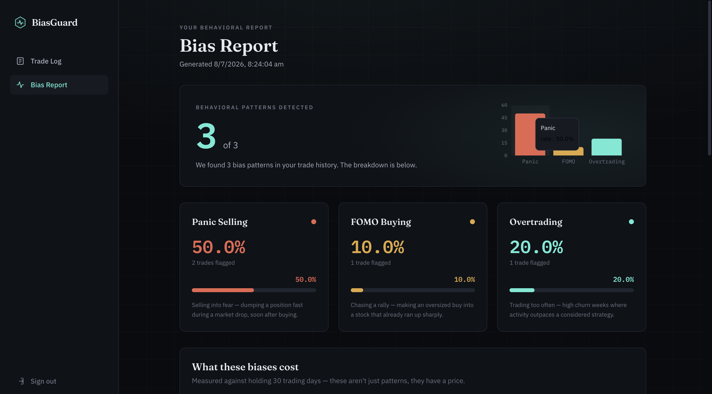
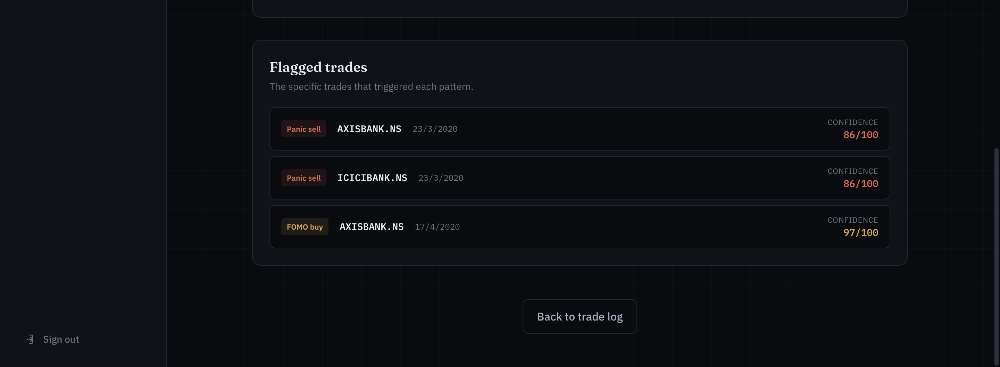
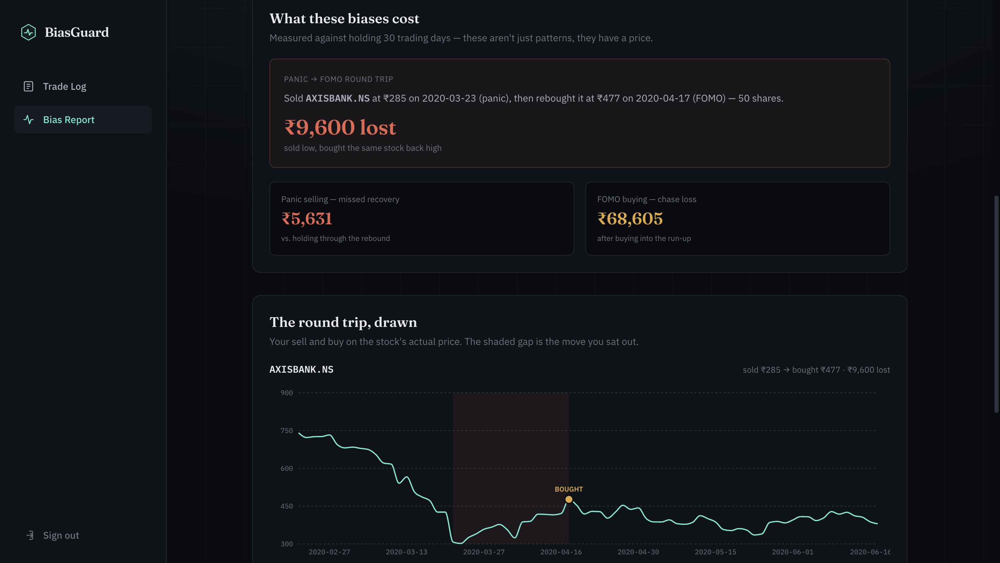
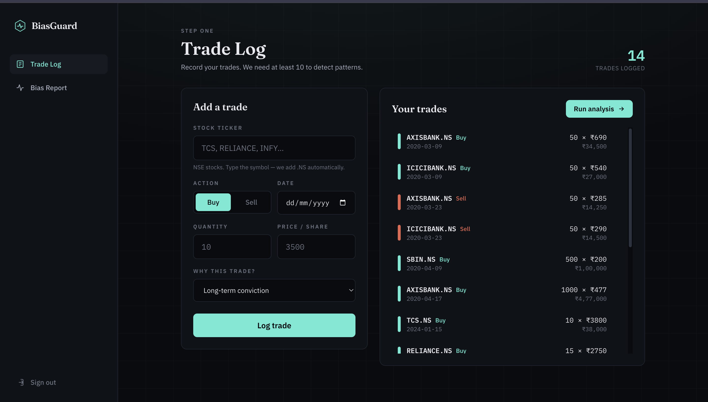

# BiasGuard

A full-stack web app that detects and quantifies three costly trading biases — **panic selling**, **FOMO buying**, and **overtrading** — from a user's trade history, grounding every flag in real market price action rather than self-reported intent.

Built with FastAPI + React. Detection methodology follows Barber & Odean's research on retail investor behavior.

---

## Screenshots

### Bias report


### Cost of bias & flagged trades


### Panic-sell timeline


### Trade log


## The idea

Retail investors lose money to predictable behavioral patterns: selling into crashes, chasing stocks that have already run up, and churning their portfolios. Most people can't see these patterns in their own history because each individual trade felt justified at the time.

BiasGuard takes a user's trade log, enriches every trade with actual market data from the trade date, and asks a simple question of each one: *does the price action around this trade match a known bias signature?* When it does, the app flags it, explains why, and estimates what the bias cost in rupees.

The key design principle: **detectors read market behavior, not user intent.** A sell is not a panic sell because the user felt panicked — it's a panic sell because the stock had just fallen sharply, the position was young, and most of it was dumped at once. Every flag is reproducible from price data.

## The three detectors

All thresholds live in a single `CONFIG` block in `bias_engine.py` — one source of truth, easy to tune, easy to defend.

### 1. Panic selling
A sell is flagged when **all three** hold:
- the stock fell **≤ −5% over the prior 3 trading days** (a sharp local drawdown, not ordinary noise),
- the position was held **< 30 days** (long-term holders selling into weakness are rebalancing, not panicking),
- **≥ 50% of the position** was sold (trimming is not capitulation).

The conjunction matters. Any one condition alone produces false positives; requiring all three means a flag is hard to explain away.

### 2. FOMO buying
A buy is flagged when **both** hold:
- the stock ran up **≥ 20% over the prior 7 trading days** (chasing momentum after the move),
- the position size is **≥ 2× the user's median buy** (oversized conviction at exactly the wrong moment).

Size matters as much as timing: a small experimental buy after a runup is curiosity; an oversized one is FOMO.

### 3. Overtrading
Flagged when the user places **≥ 7 trades in a rolling week** — churn at a frequency Barber & Odean showed correlates with underperformance in retail accounts.

## Cost of bias

Flags without numbers don't change behavior, so each flagged trade gets a counterfactual priced over a **30-trading-day forward window**:

- **Panic sells** → missed recovery: what the sold shares were worth 30 trading days later vs. the panic-sale proceeds.
- **FOMO buys** → chase loss: what the position lost as the momentum faded.
- **Round trips** → the cost of selling low and rebuying high (e.g., selling at ₹285 in a crash and rebuying the same stock at ₹477 a month later).

Thirty trading days is a deliberate compromise: long enough for crash-recovery dynamics to play out, short enough that the counterfactual is still attributable to the flagged trade rather than to everything that happened since.

## Architecture

```
frontend/  React + Vite + Tailwind + Framer Motion + Recharts
backend/   FastAPI + SQLAlchemy (SQLite) + JWT auth (bcrypt) + yfinance
```

- **Market data:** yfinance, normalized to NSE (`.NS` suffix), benchmarked against the Nifty 50 (`^NSEI`). Prices are cached in the database so repeat analyses don't refetch.
- **Trade enrichment:** trades are joined to price history with `merge_asof(direction="backward")` — exact-date joins silently produce NaN on weekends and holidays; nearest-prior-trading-day is the correct semantics.
- **Analysis gate:** requires ≥ 10 trades. Pattern detection on fewer trades is noise dressed up as insight.
- **Auth:** JWT with `exp` and `iat` claims, bcrypt password hashing (used directly, with correct handling of bcrypt's 72-byte limit), secrets from environment variables, and a fail-closed guard that refuses to start in production with a placeholder secret.

## Running locally

```bash
# backend
cd backend
pip install -r requirements.txt
uvicorn main:app --reload

# frontend (separate terminal)
cd frontend
npm install
npm run dev
```

Sign up, then either log trades manually or click **"Load sample data & analyze"** on an empty trade log — it loads a curated 13-trade dataset (built around the March 2020 COVID crash) that triggers all three detectors and lands you on a full report in one click.

## Design decisions

**Why rule-based, not machine learning?** Because the ground truth doesn't exist. There is no labeled dataset of "this trade was a panic sell" — any ML model would be trained on labels produced by rules anyway, adding opacity without adding knowledge. Transparent rules grounded in published research (Barber & Odean) are more defensible than an unexplainable classifier, and every flag can be justified to the user in one sentence.

**Why three separate detectors instead of one composite "bias score"?** Because a composite score requires weighting the biases against each other, and there's no principled basis for those weights. "Your panic score is 86/100 because you dumped AXISBANK after a 34% three-day drop" is actionable. "Your bias score is 61" is astrology.

**Why these specific thresholds?** They're judgment calls, calibrated against real NSE data (the −5%/3-day panic threshold, for instance, cleanly separates the March 2020 crash days from ordinary volatility), and they're all in one config block precisely *because* they're judgment calls — tunable, visible, and honest about being parameters rather than laws.

## Honest limitations

- **Data source:** yfinance is unofficial and can break or rate-limit. Fine for a demo; a production system would need a licensed data feed.
- **Thresholds are heuristics.** −5%, 30 days, 2× median — all defensible, none sacred. Different parameters would flag different trades.
- **Detectors infer intent from price action** — that's the design principle, but it means a genuinely rational sale that happens to coincide with a crash will be flagged. The confidence score communicates this uncertainty; it doesn't eliminate it.
- **Daily data only.** Intraday panic (buying the open, dumping at the close) is invisible.
- **Not deployed.** This runs locally. Rate limiting on auth endpoints, HTTPS, and a production database are deliberately deferred to deployment — and until then, this is a demo for sample or personal data, **not** a service for collecting third-party financial data.

## Roadmap

- Deployment (managed hosting, HTTPS, production DB, rate limiting on `/login` and `/signup`)
- A statistical layer testing whether flagged biases actually predict portfolio underperformance for a given user — turning detection into evidence

---

*Built by Rudra Jadhav and Janhvi.*
